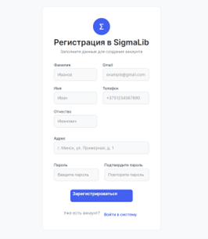
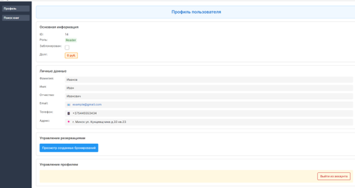
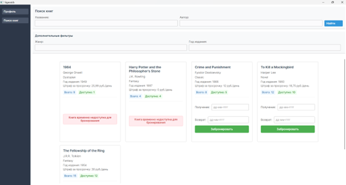
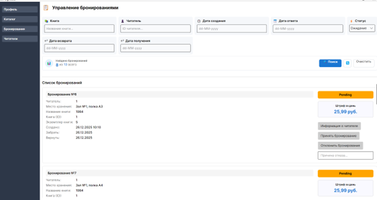
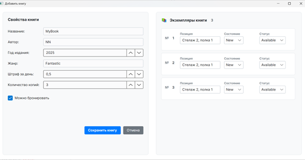
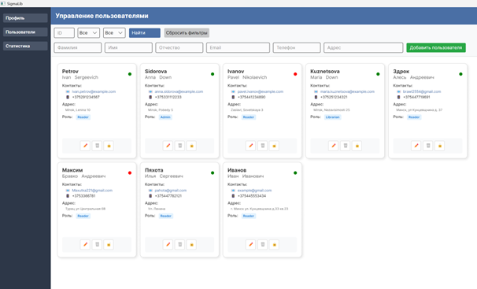
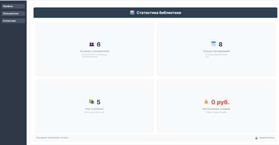

# SigmaLib - Система управления библиотекой
---
## 📑 Содержание
- [📚 Обзор проекта](#-обзор-проекта)
- [🎯 Функциональные возможности по ролям](#-функциональные-возможности-по-ролям)
  - [👤 Читатель](#-читатель)
  - [📋 Библиотекарь](#-библиотекарь)
  - [⚙️ Администратор](#-администратор)
- [🏗️ Архитектура системы](#️-архитектура-системы)
  - [Технологический стек](#технологический-стек)
  - [Структура базы данных](#структура-базы-данных)
- [📸 Скриншоты](#-скриншоты)
  - [🔑 Экран входа](#-экран-входа)
  - [📝 Регистрация](#-регистрация)
  - [🏠 Главное меню / Профиль](#-главное-меню--профиль)
  - [⚙️ Поиск и настройки](#-поиск-и-настройки)
  - [📚 Бронирования](#-бронирования)
  - [➕ Добавление книги](#-добавление-книги)
  - [👥 Пользователи / Уроки](#-пользователи--уроки)
  - [📊 Статистика](#-статистика)
- [🚀 Установка и запуск](#-установка-и-запуск)
- [🔐 Аутентификация и авторизация](#-аутентификация-и-авторизация)
- [📄 Генерация документов](#-генерация-документов)
- [📊 Статистические отчеты](#-статистические-отчеты)
- [📞 Поддержка](#-поддержка)
---
## 📚 Обзор проекта
**SigmaLib** - это современная система управления библиотекой, разработанная на платформе .NET с использованием AvaloniaUI для кроссплатформенного интерфейса и SQLite в качестве базы данных.

## 🎯 Функциональные возможности по ролям

### 👤 **Читатель**
- **Просмотр профиля**: Личная информация и активность
- **Поиск книг**: 
  - По названию, автору, жанру, ISBN
  - Фильтрация по доступности
- **История бронирований**:
  - Текущие бронирования
  - История прошлых заказов
  - Статусы заявок
- **Бронирование книг**:
  - Выбор книги из каталога
  - Указание периода бронирования
  - Отслеживание статуса бронирования

### 📋 **Библиотекарь**
- **Управление библиотечным фондом**:
  - ✅ Добавление новых книг
  - ✏️ Редактирование информации о книгах
  - ❌ Удаление книг из каталога
  - 🔍 Расширенный поиск по книгам
- **Работа с читателями**:
  - Поиск читателей по различным критериям
  - Просмотр истории активности читателя
  - Снятие задолженностей
- **Управление бронированиями**:
  - Просмотр всех активных заявок
  - ✅ Одобрение бронирований
  - ❌ Отклонение бронирований с указанием причины
- **Оформление операций**:
  - Выдача книги (создание договора передачи в Word)
  - Прием возврата книги (создание акта возврата в Word)
  - Автоматическое обновление статуса книги

### ⚙️ **Администратор**
- **Управление пользователями**:
  - 👥 Добавление новых пользователей
  - ✏️ Редактирование данных пользователей
  - ❌ Удаление пользователей
  - 🔍 Расширенный поиск пользователей
- **Статистика и аналитика**:
  - Общая статистика библиотеки
  - Популярность книг (топ-10)
  - Активность читателей
  - Отчеты по периодам
- **Системные функции**:
  - Управление ролями пользователей
  - Резервное копирование данных
  - Просмотр логов системы

## 🏗️ Архитектура системы

### **Технологический стек:**
- **Платформа**: .NET 8.0
- **Интерфейс**: AvaloniaUI (кроссплатформенный)
- **База данных**: SQLite
- **IDE**: Visual Studio 2022
- **Документы**: Microsoft Word Interop / OpenXML
- **Система контроля версий**: Git

### **Структура базы данных:**
```-- Основные таблицы:

-- Таблица пользователей (Users)
Users (
    Id INTEGER PRIMARY KEY AUTOINCREMENT,
    Email TEXT NOT NULL UNIQUE,               -- Username (используется Email)
    Password TEXT NOT NULL,                   -- PasswordHash
    FirstName TEXT NOT NULL,                  -- PersonalData
    LastName TEXT NOT NULL,                   -- PersonalData
    SurName TEXT NOT NULL,                    -- PersonalData
    Phone TEXT UNIQUE NOT NULL,               -- PersonalData
    Address TEXT NOT NULL,                    -- PersonalData
    IsBlocked INTEGER NOT NULL DEFAULT 0,     -- PersonalData
    Role TEXT NOT NULL,                       -- Role: Reader/Librarian/Admin
    TotalFine DECIMAL(10,2) NOT NULL DEFAULT 0 -- PersonalData
)

-- Таблица книг (Books)
Books (
    Id INTEGER PRIMARY KEY AUTOINCREMENT,
    Title TEXT NOT NULL,
    Author TEXT,
    Year INTEGER,                            -- Аналог дополнительной информации
    Genre TEXT NOT NULL,
    Price DECIMAL(10,2) NOT NULL,            -- Дополнительное поле
    TotalCopies INTEGER NOT NULL,            -- Дополнительное поле
    AvailableCopies INTEGER NOT NULL DEFAULT 0, -- Статус доступности
    is_reservable INTEGER NOT NULL DEFAULT 1  -- Статус возможности бронирования
    -- В текущей схеме отсутствует ISBN, можно добавить
)

-- Таблица экземпляров книг (BookCopies)
-- Отдельная таблица для физических копий
BookCopies (
    Id INTEGER PRIMARY KEY AUTOINCREMENT,
    IdBook INTEGER NOT NULL,                  -- BookId (ссылка на Books.Id)
    Location TEXT NOT NULL,                   -- Местоположение
    Status TEXT NOT NULL,                     -- Status: Available/Reserved/CheckedOut/Archived
    Condition TEXT NOT NULL,                  -- Состояние: New/Good/Damaged/Excellent
    FOREIGN KEY (IdBook) REFERENCES Books(Id) ON DELETE CASCADE
)

-- Таблица бронирований (Reservations)
Reservations (
    Id INTEGER PRIMARY KEY AUTOINCREMENT,
    ReaderId INTEGER NOT NULL,                -- UserId
    BookCopyId INTEGER NOT NULL,              -- BookId (ссылка на BookCopies.Id)
    Status TEXT NOT NULL,                     -- Status: Pending/Approved/Rejected/Completed
    CreatedAt TEXT NOT NULL,                  -- Dates: Дата создания
    PickupDate TEXT,                          -- Dates: Дата получения
    ReturnDate TEXT,                          -- Dates: Планируемая дата возврата
    ResponseDate TEXT,                        -- Dates: Дата ответа библиотекаря
    ActualReturnDate TEXT,                    -- Dates: Фактическая дата возврата
    Reason TEXT,                              -- Причина отклонения
    Fine DECIMAL(10,2) NOT NULL DEFAULT 0,    -- Штраф
    RespondedByLibrarianId INTEGER,           -- Кто обработал заявку
    FOREIGN KEY (ReaderId) REFERENCES Users(Id) ON DELETE CASCADE,
    FOREIGN KEY (BookCopyId) REFERENCES BookCopies(Id) ON DELETE CASCADE,
    FOREIGN KEY (RespondedByLibrarianId) REFERENCES Users(Id) ON DELETE CASCADE
)
```

# 📸 Скриншоты

## 🔑 Экран входа
<p align="center">
  <a href="Screenshots/login.png">
    
  </a>
</p>

## 📝 Регистрация
<p align="center">
  <a href="Screenshots/Registration.png">
    
  </a>
</p>

## 🏠 Главное меню / Профиль
<p align="center">
  <a href="Screenshots/Profile.png">
    
  </a>
</p>

## ⚙️ Поиск и настройки
<p align="center">
  <a href="Screenshots/SearchBooks.png">
    
  </a>
</p>

## 📚 Бронирования
<p align="center">
  <a href="Screenshots/Reservations.png">
    
  </a>
</p>

## ➕ Добавление книги
<p align="center">
  <a href="Screenshots/CreateBook.png">
    
  </a>
</p>

## 👥 Пользователи / Уроки
<p align="center">
  <a href="Screenshots/Users.png">
    
  </a>
</p>

## 📊 Статистика
<p align="center">
  <a href="Screenshots/statistics.png">
    
  </a>
</p>

## 🚀 Установка и запуск

### **Предварительные требования:**
1. Visual Studio 2022 (или новее)
2. .NET 8.0 SDK
3. SQLite
4. Microsoft Word (для генерации документов)

### **Шаги установки:**
```bash
# 1. Клонирование репозитория
git clone <repository-url>
cd SigmaLib

# 2. Восстановление зависимостей
dotnet restore

# 3. Создание базы данных
# База данных автоматически создается при первом запуске
# Или используйте скрипт миграции

# 4. Запуск приложения
dotnet run
```

## 🔐 Аутентификация и авторизация

### **Роли пользователей:**
1. **Reader** (Читатель) - базовый доступ
2. **Librarian** (Библиотекарь) - расширенный доступ
3. **Admin** (Администратор) - полный доступ

### **Процесс входа:**
1. Ввод логина и пароля
2. Проверка учетных данных в БД
3. Загрузка соответствующего интерфейса по роли

## 📄 Генерация документов

### **Автоматически создаваемые документы:**
1. **Договор передачи книги** (при выдаче):
   - Данные читателя
   - Информация о книге
   - Срок возврата

2. **Акт возврата книги**:
   - Отметка о возврате
   - Расчет штрафов (при необходимости)

**Формат**: .docx (Microsoft Word)
**Расположение**: `Assets/Contracts/`

## 📊 Статистические отчеты

### **Доступные отчеты:**
- количество пользователей
- количество активных бронирований
- количество книг в каталоге
- общая сумма неоплаченных штрафов


### **Основные экраны:**
1. **Экран входа** - аутентификация
2. **Главное меню** - зависит от роли
3. **Каталог книг** - поиск и фильтрация
4. **Профиль пользователя** - личные данные
5. **Панель управления** (для библиотекаря/админа)

## 📞 Поддержка

### **В случае проблем:**
1. Проверьте наличие .NET 8.0 SDK
2. Убедитесь в доступности SQLite

*Последнее обновление: 16.01.2026*  
*Версия: 1.0.0*
*Разработано с использованием: C#, AvaloniaUI, SQLite, Visual Studio 2022*